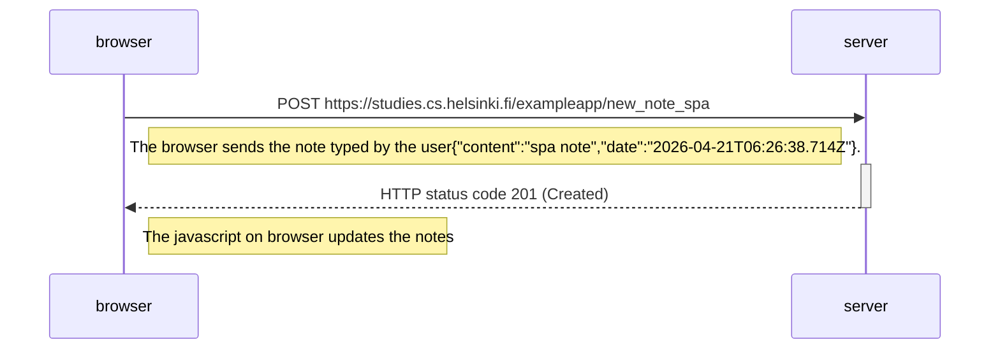

```mermaid
sequenceDiagram
    participant browser
    participant server

    browser->>server: POST https://studies.cs.helsinki.fi/exampleapp/new_note_spa
    Note right of browser: The browser sends the note typed by the user{"content":"spa note","date":"2026-04-21T06:26:38.714Z"}.
    activate server
    server-->>browser: HTTP status code 201 (Created)
    deactivate server

    Note right of browser: The javascript on browser updates the notes
    
```